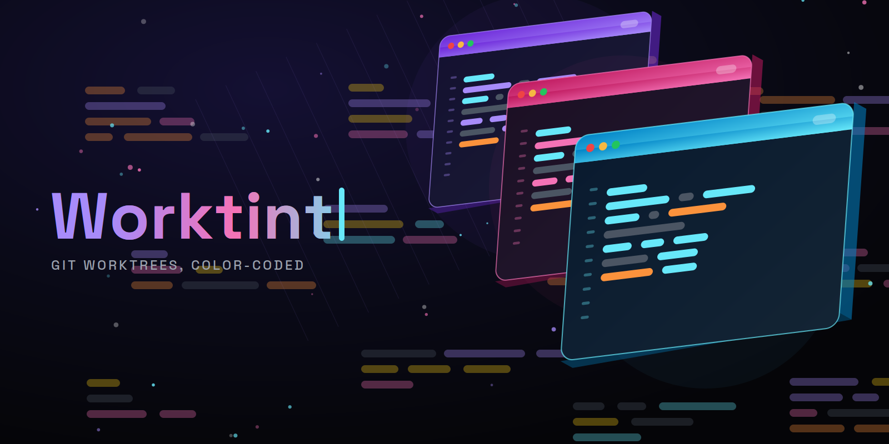

# Worktint

[](https://marketplace.visualstudio.com/items?itemName=jancassio.worktint)
[](https://marketplace.visualstudio.com/items?itemName=jancassio.worktint)
[](https://marketplace.visualstudio.com/items?itemName=jancassio.worktint)
[](https://open-vsx.org/extension/jancassio/worktint)
[](https://github.com/jancassio/worktint/actions/workflows/ci.yml)
[](LICENSE)

Auto-colors your VS Codium / VS Code window per **git worktree**, so parallel
windows of the same repository are instantly distinguishable.

## Screenshots

<!-- MAINTAINER TODO: capture images/hero.png — two side-by-side VS Code /
     VS Codium windows on the same repo's worktrees, each tinted a distinct
     color (title bar + status bar visible), to make the effect obvious at a
     glance. -->



*Two worktrees of the same repository, instantly distinguishable by color.*

Running several worktrees of one repo — say, a few AI agents each on their own
branch — leaves you with a row of identical-looking editor windows. Worktint
gives each worktree a stable, theme-appropriate color and a labeled status-bar
indicator, so you always know which window is which.

## Install

**VS Code Marketplace**

Search for "Worktint" in the Extensions view, or install from the
[Marketplace listing](https://marketplace.visualstudio.com/items?itemName=jancassio.worktint).

**Open VSX** (VS Codium and other Open VSX-based editors)

Install from the [Open VSX listing](https://open-vsx.org/extension/jancassio/worktint).

**Command line**

```bash
code --install-extension jancassio.worktint
# or, for VS Codium:
codium --install-extension jancassio.worktint
```

## Activation: dormant until you actually have worktrees

Worktint does **nothing** until a repository has **more than one worktree**
(`<git-common-dir>/worktrees/` is non-empty). In an ordinary single-checkout
repo it stays fully dormant — no status-bar item, no writes, no prompts. Add a
second worktree (`git worktree add ../feature`) and it wakes up; drop back to a
single worktree and it cleans up after itself.

## Two layers

1. **Status-bar indicator** (always on when active) — a colored dot plus the
   branch name. Zero files written, zero git footprint. Toggle with
   `worktint.statusBarIndicator.enabled`.
2. **Chrome tint** (optional, on by default) — tints the title bar, activity
   bar, status bar, and the active editor-tab accent by writing
   `workbench.colorCustomizations` to the worktree's `.vscode/settings.json`.

## Zero git footprint

- The worktree's `.vscode/settings.json` is hidden from git via
  `.git/info/exclude` — Worktint never touches your tracked `.gitignore`.
- If `.vscode/settings.json` is **already tracked** in your repo, Worktint won't
  dirty a committed file: it warns once and falls back to the status-bar
  indicator only.
- It **never clobbers your colors**. Only Worktint's own keys are merged into
  `workbench.colorCustomizations`, and the prior value of each is recorded so a
  reset restores your settings exactly.

## Colors

Each worktree's color is seeded from its **root path**, so it's stable and
deterministic across restarts — the same worktree always gets the same color,
and different worktrees of a repo get different ones (with collision probing).
The branch name is display-only and never affects the color. Palettes are
theme-aware (curated light and dark sets, 8 colors each).

## Settings

All settings live under the `worktint.*` namespace and default to `true`.

| Setting | Default | Description |
| --- | --- | --- |
| `worktint.chrome.enabled` | `true` | Tint window chrome for worktrees. |
| `worktint.chrome.titleBar` | `true` | Tint the title bar (needs `window.titleBarStyle: custom`). |
| `worktint.chrome.activityBar` | `true` | Tint the activity bar. |
| `worktint.chrome.statusBar` | `true` | Tint the status bar. |
| `worktint.chrome.editorTabs` | `true` | Tint the active editor-tab accent. |
| `worktint.statusBarIndicator.enabled` | `true` | Show the colored status-bar worktree indicator. |

## Commands

| Command | Description |
| --- | --- |
| `Worktint: Pick color for this worktree` | Override this worktree's color from the palette. |
| `Worktint: Reset this worktree` | Restore this worktree's colors and remove the exclude line. |
| `Worktint: Reset all` | Revert every worktree Worktint has colored in this repo. |
| `Worktint: Toggle chrome coloring` | Turn the chrome tint on or off. |

## Requirements

- VS Codium or VS Code `^1.90.0`.
- Title-bar tinting requires `window.titleBarStyle: custom`. If it isn't set,
  Worktint offers to set it once and simply skips the title bar until you do —
  the other chrome elements still tint.

## Development

Built with [Bun](https://bun.sh). Integration tests run in a real VS Code via
[`@vscode/test-electron`](https://github.com/microsoft/vscode-test).

```bash
bun install
bun run build            # bundle to dist/extension.js
bun run test:unit        # framework-free core + adapter unit tests
bun run test:integration # in-editor integration tests (downloads VS Code)
bun run lint             # Biome check (lint + format)
```

Press <kbd>F5</kbd> (**Run Extension**) to launch an Extension Development Host.

## Contributing

Contributions are welcome. See [CONTRIBUTING.md](CONTRIBUTING.md) for how to
set up the project, run the tests, and submit changes.

## Scope

This is an MVP. A smart-from-theme palette, non-worktree repo coloring,
multi-root workspaces, and cross-machine sync are out of scope.

## License

[MIT](LICENSE)
